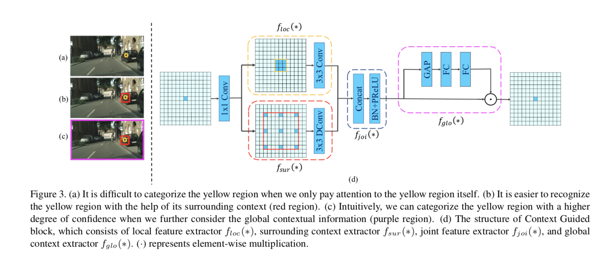

This paper works on a increasing speed and reducing memory usage in segmentation neural nets.

## Excited About Speed

I was excited to read this paper because it seems like most segmentation neural networks are pretty slow. For instance UNet takes 200ms to do one 512x512 image. 200ms is fast but think about how slow it becomes as you scale up the image size - 1024x1024 would take 800ms and 2048x2048 would take 3.2 seconds. And of course this is on a fast GPU.

I recently ran a resnet inference on a 1024x1024 image and it took 5.5 seconds on my laptop. Is that fast enough? Of course it depends on the use-case - but if you want to do it over and over for users that aren't paying much or at all, the server costs will add up.

I think there is likely some overlap between papers that try to do segmentation QUICKLY - such as for live video - and those that try to do it on MOBILE. In both cases the network has to perform well, but in the mobile case memory is also constrained.

## Review

After reading the paper, I don't think it is something that I would implement. The IoU of 65 is good when you consider that the model only uses about half a million parameters, but it's hard to live with that when there are other models with 80+ IoU.

## Architecture 

The primary contribution of the paper is the 'CG block'. It doesn't make intuitive sense to me. It claims to incorporate the 'context' of a pixel in order to help with segmentation. But when you dive in you find out the 'context' is just a spaced-out conv:

So it does include contex, but just a little piece of the context.

