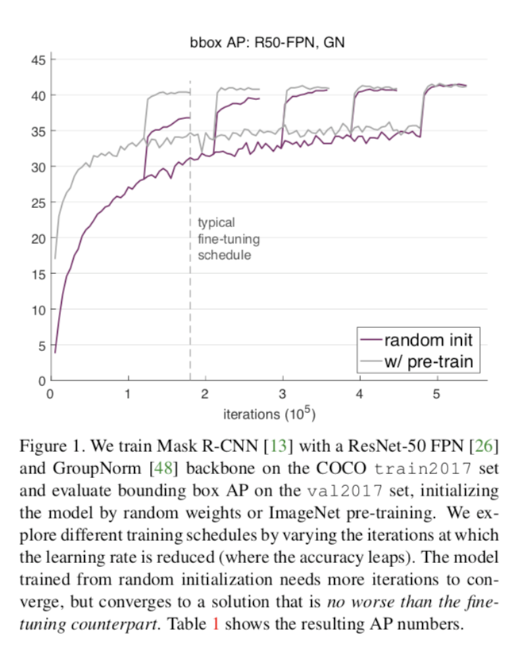

This paper is a comparison between using a network pretrained on ImageNet vs starting a new net with random weights.

*Bottom line:* For segmentation problems, networks trained from scratch perform just as well as networks pretrained on ImageNet, as long as both networks get the same amount of total training time.

The first figure is a good summary:

My takeaway was that if you have a pretrained net handy, you should use it. But there are some situations in which you need not bother with pretraining.

Pretraining may not be worth the effort IF:

* you are working on a segmentation problem AND
* you are creating a new architecture

Important note: this paper only showed that networks trained from scratch can perform AS WELL as pretrained networks, not better.
